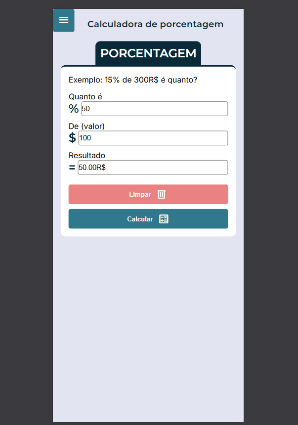
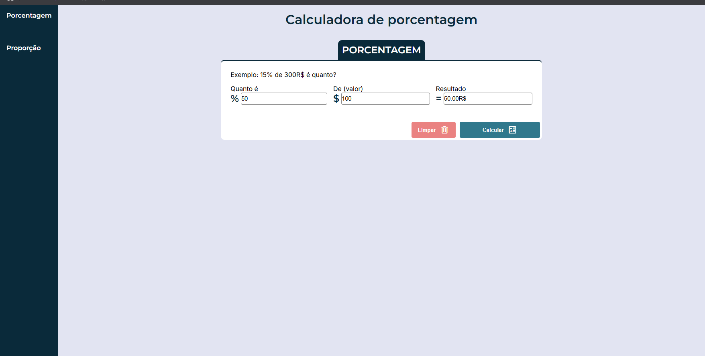

Projeto de Navegação Responsiva com Interatividade
Este projeto tem como objetivo criar uma interface de navegação responsiva que permite a interação do usuário com um menu de navegação dinâmico, onde é possível calcular proporções e porcentagens de forma simples e intuitiva. Além disso, inclui um botão de "limpar" que remove os inputs preenchidos, melhorando a experiência do usuário.

Funcionalidades
Menu de Navegação Responsivo: O menu se adapta automaticamente a diferentes tamanhos de tela (desktop e dispositivos móveis), sendo oculto em telas menores e podendo ser aberto por um botão.

Interatividade com Botões: O projeto inclui botões que executam ações como calcular proporções e porcentagens, além de limpar os campos de input.

Design Limpo e Moderno: Utiliza uma paleta de cores minimalista, com foco em proporcionar uma boa experiência visual e usabilidade.

Tecnologias Utilizadas
HTML: Estruturação do conteúdo e criação da navegação.

CSS: Estilização responsiva e interativa com flexbox e media queries.

JavaScript: Funcionalidade de navegação dinâmica com AJAX e manipulação de DOM.

Como Usar
Abra o projeto em seu navegador.

Clique no botão de navegação para abrir o menu (disponível em dispositivos móveis).

Utilize os campos de input para calcular as proporções ou porcentagens.

Use o botão de limpar para zerar os campos.

Aqui está uma imagem do meu projeto:

  
  

